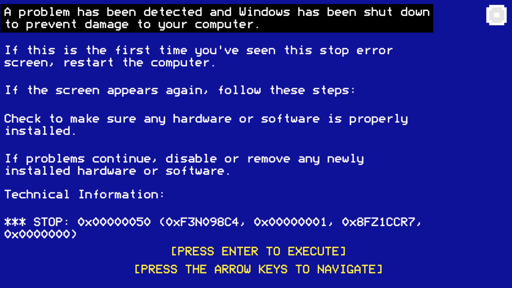

# Small World, Small Errors

### Description
Welcome to "Small World, Small Errors," a submission for Ludum Dare Game Jam 38 under the theme "A Small World." Created by **Empowered Pixel**, this 2D Unity game challenges players to navigate platforming obstacles within a simulated Blue Screen of Death environment. 

### Gameplay
In this game, you find yourself amidst a computer crash represented by the notorious Windows blue screen. To resolve the issues and restore functionality, you'll need to traverse through platforming challenges within the glitchy digital world. Each level presents unique errors to fix, pushing your platforming skills to the limit.

### Features
- **Engaging Platforming Challenges**: Navigate through various platforming obstacles and puzzles.
- **Interactive Blue Screen Environment**: Immerse yourself in a Windows-style blue screen environment.
- **Fast-Paced Fixes**: Race against time to solve errors and bring the system back online.

### Gameplay Screenshots

### How to Play
1. **Play Online**: Access the game in your browser on [itch.io](https://jdmclatcher.itch.io/unexpected-errors) (Chrome or Firefox).
2. **Game Jam Entry**: Check out the [Ludum Dare Game Jam entry](https://ldjam.com/events/ludum-dare/38/my-first-ludum-dare-game-jam-heres-my-game-small-errors).
3. **Download**: Clone or download the repository.
4. **Run the Game**: Open the project in Unity and launch the game.
5. **Platforming Challenges**: Navigate through the blue screen world to fix errors.
6. **Win the Game**: Solve all challenges to repair the computer.

### Credits
- Developed by Jonathan McLatcher (Empowered Pixel)
- Created for Ludum Dare Game Jam 38 ([Ludum Dare](https://ldjam.com/))
- Date: April 2017
- Theme: A Small World

### License
This project is licensed under [MIT License](link-to-your-license).
